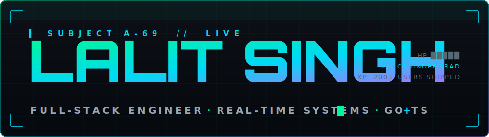

<!-- ===================  ANIMATED HERO BANNER (custom SVG)  =================== -->
<a href="https://github.com/Geltrax69">
  
</a>

<div align="center">

<!-- retro arcade font line -->
[](https://github.com/Geltrax69)

[](https://github.com/Geltrax69)


</div>

---

<!-- ===================  SUBJECT DOSSIER  =================== -->
<table>
<tr>
<td width="38%" valign="top">

```
╔══════════════════════════╗
║   SUBJECT FILE :: A-69    ║
╠══════════════════════════╣
║ NAME      Lalit Singh     ║
║ ALIAS     Geltrax69       ║
║ CLASS     Full-Stack Eng. ║
║ ORIGIN    LPU, Punjab IN  ║
║ FUNCTION  Build & Ship    ║
║ STATE     Caffeinated     ║
║ THREAT    ★ ★ ★ ★ ★       ║
╚══════════════════════════╝
```


</td>
<td width="62%" valign="top">

###  &nbsp;`./know_about_me.sh`

I'm a **CS undergrad** who got tired of static pages and started building things that
**move in real time** — live scoreboards, instant notifications, sockets that never sleep.

By day I write Go and TypeScript. By night I refactor things that already worked, tell
myself it's "for scale," and break them. I shipped real features to **200–500 actual users**
as an intern before I was allowed to call myself a developer.

I treat `undo/redo`, `auth`, and `deploy` as first-class citizens — not afterthoughts.

```yaml
currently:   building ScoreCast — a real-time sports scoreboard in Golang
intern_at:   Simpedu LLP  →  React + REST for 200+ users
certified:   Oracle Cloud AI Foundations · Data Platform Foundations
flex:        Top 15 / 500+ Code-A-thon  ·  200+ LeetCode solved
philosophy:  own it end-to-end — design, build, deploy, monitor, repeat
```

</td>
</tr>
</table>

---

<!-- ===================  ARSENAL  =================== -->
###  &nbsp;`./arsenal --load`

<div align="center">

<picture></picture>
<br/>
<picture></picture>
<br/>
<picture></picture>

</div>

---

<!-- ===================  TOP MISSIONS  =================== -->
###  &nbsp;`./top_missions --sort=impact`

<table>
<tr>
<td width="50%" valign="top">

####  ScoreCast — Real-Time Scoreboard
> One Go WebSocket hub. Scores, timers & events sync **instantly** across scorer phones, admin panels and broadcast screens. QR / 4-digit pairing with JWT device tokens. Event-driven sets, undo/redo, completion.

`Golang` `Gin` `WebSocket` `PostgreSQL` `React` `TS` `Docker`

</td>
<td width="50%" valign="top">

####  Simpedu — School Platform
> Multi-tenant system **live in 3 schools / 100–200 students**. REST APIs, JWT + role-based access, Firebase push for homework / fees / announcements. Web **+** mobile.

`Next.js` `Node` `Express` `MongoDB` `FCM`

</td>
</tr>
<tr>
<td width="50%" valign="top">

####  RestaurantOS — QR Ordering SaaS
> Instagram-styled, multi-tenant ordering. Admins mint owner accounts, owners publish full menus, customers order live at `/r/:slug`.

`React` `Multi-tenant` `Admin+Owner+Customer`

</td>
<td width="50%" valign="top">

####  Stock Predictor — Stacked LSTM
> Predicts next-day price direction from 5yrs of OHLCV technicals across AAPL · MSFT · GOOGL · AMZN · NVDA.

`Python` `TensorFlow` `LSTM`

</td>
</tr>
</table>

<div align="center">

[](https://github.com/Geltrax69?tab=repositories)

</div>

---

<!-- ===================  PAC-MAN CONTRIBUTION GAME  =================== -->
###  &nbsp;`./play --map=contributions`

<div align="center">


<!-- Pac-Man eating my contribution graph 🟡 -->
<picture>
  <source media="(prefers-color-scheme: dark)" srcset="https://raw.githubusercontent.com/Geltrax69/Geltrax69/output/pacman-contribution-graph-dark.svg" />
  
</picture>

<!-- Breakout, second game 🧱 -->
<picture>
  <source media="(prefers-color-scheme: dark)" srcset="https://raw.githubusercontent.com/Geltrax69/Geltrax69/output/breakout-contribution-graph-dark.svg" />
  
</picture>

</div>

---

<!-- ===================  CONNECT  =================== -->
<div align="center">

###  &nbsp;`./connect`

<a href="https://github.com/Geltrax69"></a>
<a href="mailto:lalit.builds@gmail.com"></a>


<br/><br/>

> *"Code is never finished. It only gets deployed."*


</div>
