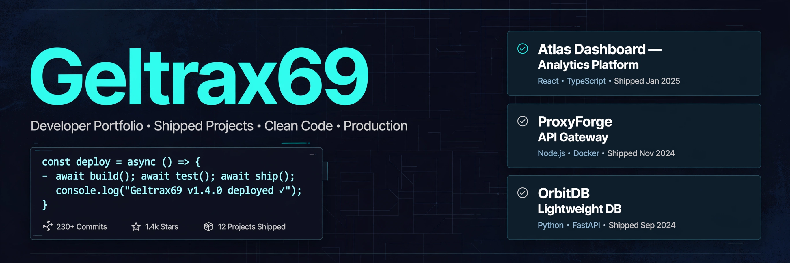

# Geltrax69

  

> ## Status: 🟢 Active builder
>
> **Harsh Khajuria** — I build and ship real projects, end to end.

---

## About Geltrax

I'm **Harsh Khajuria**, building under the handle **Geltrax69**. I make things that actually run — web apps, native macOS/iPad apps, games, simulations, and AI-generated visuals — and I ship them to public repos instead of letting them rot in a drafts folder.

This profile currently hosts **68 public repositories** across **JavaScript, Swift, Java, TypeScript, Python, C#, and more**. I treat design, build, and deploy as one job, not three.

---

## Featured projects

| Project | What it is |
|---|---|
| [Campfire_Cooking](https://github.com/Geltrax69/Campfire_Cooking) | A living-world simulation game in C# — ecosystems, town growth, trade routes, generations — with 875 green tests. |
| [Crazy_Wallpaper](https://github.com/Geltrax69/Crazy_Wallpaper) | "Papier" — a wallpaper store in React 19 + Vite: cart, filters, product lightbox, dark mode. |
| [1900s_NewsPaper_Style](https://github.com/Geltrax69/1900s_NewsPaper_Style) | "The Motoring Gazette" — an antique-newspaper car site with 8 verified classic-car profiles, search/filters, a comparison table, and a 36-frame interactive 360° viewer. |
| [mac_TaskManager](https://github.com/Geltrax69/mac_TaskManager) | "MacCleaner" — a native Swift macOS task manager: live CPU/RAM dashboards, process table, safe kill, details inspector. |
| [screesaver](https://github.com/Geltrax69/screesaver) | A fullscreen Mac lockscreen animation collection — 4 character entrance variants, staggered clock, mock-desktop unlock. |
| [ColourCombos](https://github.com/Geltrax69/ColourCombos) | Poster-derived color palettes plus a categorized font bundle (display / readable / mono) for future web work. |
| [Harrypotter](https://github.com/Geltrax69/Harrypotter) | "Living Page" — a Pencil-first iPad Q&A notebook with a Fastify/TypeScript backend. |
| [Fun](https://github.com/Geltrax69/Fun) | Open playground repo for experiments and image-generation play. |

---

## Tech stack

| Layer | Stack |
|---|---|
| Languages (by repo count) | JavaScript · Swift · Java · TypeScript · Python · C# · HTML/CSS · Dart · C++ |
| Web | React · Vite · Tailwind CSS |
| Native | Swift (macOS / iPad) · .NET |
| Tooling | Git · GitHub Actions |

---

## Currently working on

Recent activity (October 2026): **StockFlow** and **QR-Menu-Order** (Java/JavaScript apps), **Bubble_Corrector** (a Swift word game — *WordPop*), and continued work on the native macOS task manager (**mac_TaskManager**).

---

<!-- Pac-Man eating the contribution graph (includes private contributions) -->
<picture>
  <source media="(prefers-color-scheme: dark)" srcset="https://raw.githubusercontent.com/Geltrax69/Geltrax69/output/pacman-contribution-graph-dark.svg" />
  
</picture>

### Connect

  

> *"Code is never finished. It only gets deployed."*

---
*README written after code audit on 2026-10-08.*
